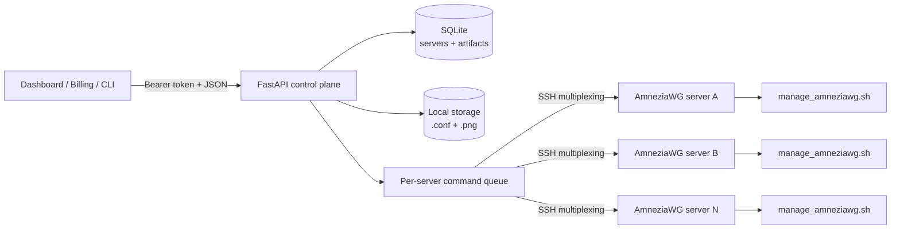

<div align="center">


# AmneziaWG API

**A compact control plane for managing AmneziaWG clients across remote servers.**

Turn SSH-based operations into a clean HTTP API: register servers, provision peers,
manage expiration dates, and deliver ready-to-import configs and QR codes.

[](https://www.python.org/)
[](https://fastapi.tiangolo.com/)
[](https://www.docker.com/)
[](https://www.sqlite.org/)
[](#how-it-works)
[](LICENSE)

[English](README.md) · [Русский](README.ru.md) · [Quick start](#quick-start) · [API](#api-reference) · [Security](#security)

</div>

> [!IMPORTANT]
> This project manages existing AmneziaWG installations. It does not install
> AmneziaWG on remote servers by itself.

## Why This Project

AmneziaWG is commonly administered through shell scripts on each VPN host.
That works well for one server, but becomes awkward when another service,
dashboard, or billing system needs to provision clients automatically.

AmneziaWG API provides a small orchestration layer on top:

| Capability | What it gives you |
|---|---|
| Multi-server registry | Keep connection details for multiple VPN nodes in SQLite |
| Client lifecycle | Create, list, extend, and remove AmneziaWG clients |
| Subscription dates | Use a human-friendly `DD.MM.YYYY` expiration date |
| Config delivery | Download generated `.conf` files and QR-code PNGs through the API |
| Per-server queue | Prevent overlapping management commands on the same server |
| SSH connection reuse | Reduce repeated SSH handshake overhead with multiplexing |
| Container deployment | Run the control plane with Docker Compose and persistent volumes |

## Architecture



The API does not implement the VPN protocol. It securely invokes
`manage_amneziawg.sh` over SSH, normalizes its output, stores server metadata
and generated artifact references, then exposes the workflow through FastAPI.

## Quick Start

### Prerequisites

Control-plane host:

- Python `3.12+`
- OpenSSH client
- SSH key access to every managed server

Each managed VPN server:

- a working AmneziaWG installation;
- Bash `4+`;
- `manage_amneziawg.sh` available, by default at
  `/root/awg/manage_amneziawg.sh`;
- `qrencode` installed if QR-code generation is required;
- permission for the SSH user to execute the management script through `sudo`.

### 1. Configure

```bash
git clone https://github.com/taphix/amneziawg-api.git
cd amneziawg-api
cp .env.example .env
```

Set a strong token in `.env`:

```env
API_HOST=127.0.0.1
API_PORT=8000
API_TOKEN=replace-with-a-long-random-secret
DATABASE_PATH=./data/app.db
STORAGE_DIR=./storage
SSH_MULTIPLEXING_ENABLED=true
SSH_CONTROL_DIR=/tmp/amneziawg-ssh
SSH_CONTROL_PERSIST=10m
SERVER_QUEUE_TIMEOUT=120
```

Generate a suitable token, for example:

```bash
python -c "import secrets; print(secrets.token_urlsafe(48))"
```

### 2. Run Locally

```bash
python -m venv .venv
source .venv/bin/activate
pip install -r requirements.txt
uvicorn app:app --host 127.0.0.1 --port 8000 --reload
```

Verify the service:

```bash
set -a
source .env
set +a
curl http://127.0.0.1:8000/ \
  -H "Authorization: Bearer $API_TOKEN"
```

FastAPI documentation is available at:

- Swagger UI: `http://127.0.0.1:8000/docs`
- ReDoc: `http://127.0.0.1:8000/redoc`

### 3. Run with Docker Compose

The included Compose file is designed for a reverse proxy attached to an
external Docker network named `edge`:

```bash
cp .env.example .env
docker network create edge
docker compose up -d --build
```

The container listens on port `8228` inside the `edge` network. The current
Compose file intentionally does not publish that port to the host. Connect
your reverse proxy to `edge`, or add this mapping for direct host access:

```yaml
services:
  amneziawg-api:
    ports:
      - "8228:8228"
```

Then use `http://127.0.0.1:8228`.

> [!NOTE]
> Compose mounts `${HOME}/.ssh` into the container as `/root/.ssh:ro`.
> An `identity_file` registered through the API must therefore be a path visible
> inside the container, such as `/root/.ssh/id_ed25519`.

## Your First Client

Export connection settings once:

```bash
export AWG_API_URL="http://127.0.0.1:8000"
export AWG_API_TOKEN="replace-with-your-token"
```

### Register a Server

```bash
curl -X POST "$AWG_API_URL/api/servers" \
  -H "Authorization: Bearer $AWG_API_TOKEN" \
  -H "Content-Type: application/json" \
  -d '{
    "name": "vpn-eu-1",
    "host": "203.0.113.10",
    "user": "root",
    "port": 22,
    "identity_file": "/home/api/.ssh/id_ed25519",
    "manage_script_path": "/root/awg/manage_amneziawg.sh",
    "strict_host_key_checking": "accept-new"
  }'
```

The response includes `is_reachable`, `status`, and a human-readable
`status_label` from an immediate SSH connectivity check.

### Create a Client

```bash
curl -X POST "$AWG_API_URL/api/clients" \
  -H "Authorization: Bearer $AWG_API_TOKEN" \
  -H "Content-Type: application/json" \
  -d '{
    "server_id": 1,
    "client_name": "alice-phone",
    "expires_until": "31.12.2026"
  }'
```

Example response:

```json
{
  "succsess": true,
  "server_id": 1,
  "client_name": "alice-phone",
  "files": {
    "conf_url": "http://127.0.0.1:8000/api/files/7d0f...",
    "png_url": "http://127.0.0.1:8000/api/files/b829..."
  }
}
```

### Download the Config

Artifact downloads require the same bearer token:

```bash
curl -L \
  -H "Authorization: Bearer $AWG_API_TOKEN" \
  "http://127.0.0.1:8000/api/files/7d0f..." \
  -o alice-phone.conf
```

## API Reference

All application endpoints require:

```http
Authorization: Bearer <API_TOKEN>
```

| Method | Endpoint | Purpose |
|---|---|---|
| `GET` | `/` | Authenticated health response |
| `POST` | `/api/servers` | Register a server and check SSH connectivity |
| `GET` | `/api/servers` | List servers with live connectivity status |
| `POST` | `/api/clients` | Create a client and collect config artifacts |
| `GET` | `/api/clients/{server_id}` | List clients and available artifact URLs |
| `PATCH` | `/api/clients/subscription` | Extend a client's expiration date |
| `DELETE` | `/api/clients/{server_id}/{client_name}` | Remove a client and local artifacts |
| `GET` | `/api/files/{artifact_id}` | Download a stored `.conf` or `.png` artifact |

### List Clients

```bash
curl "$AWG_API_URL/api/clients/1" \
  -H "Authorization: Bearer $AWG_API_TOKEN"
```

Client status is normalized to `active`, `recent`, `no_handshake`, or `unknown`.
When locally stored artifacts exist, the item also includes their download URLs.

### Extend a Subscription

Dates use `DD.MM.YYYY` and resolve to the end of the selected local calendar day:

```bash
curl -X PATCH "$AWG_API_URL/api/clients/subscription" \
  -H "Authorization: Bearer $AWG_API_TOKEN" \
  -H "Content-Type: application/json" \
  -d '{
    "server_id": 1,
    "client_name": "alice-phone",
    "prolong_until": "31.12.2027"
  }'
```

The new date must be in the future and later than the client's current expiry.

### Delete a Client

```bash
curl -X DELETE "$AWG_API_URL/api/clients/1/alice-phone" \
  -H "Authorization: Bearer $AWG_API_TOKEN"
```

This removes the peer remotely and deletes its local artifact files and database
records.

> [!NOTE]
> The response field is intentionally spelled `succsess` for compatibility with
> the current API contract.

## Configuration

| Variable | Default | Description |
|---|---:|---|
| `API_HOST` | `127.0.0.1` | Documented application bind host; pass it to your process runner |
| `API_PORT` | `8000` | Documented application port; pass it to your process runner |
| `API_TOKEN` | `change-me` | Shared bearer token; always override in production |
| `DATABASE_PATH` | `./data/app.db` | SQLite database path |
| `STORAGE_DIR` | `./storage` | Local directory for downloaded configs and QR codes |
| `SSH_MULTIPLEXING_ENABLED` | `true` | Reuse SSH control connections |
| `SSH_CONTROL_DIR` | `/tmp/amneziawg-ssh` | Directory for SSH control sockets |
| `SSH_CONTROL_PERSIST` | `10m` | OpenSSH `ControlPersist` value |
| `SERVER_QUEUE_TIMEOUT` | `120` | Seconds to wait for another operation on the same server |

`API_HOST` and `API_PORT` are settings metadata; the current startup commands
set Uvicorn's host and port explicitly.

## How It Works

1. A server record stores SSH connection settings and the remote script path.
2. Each operation acquires a lock dedicated to that server ID.
3. The API runs a quoted command through the system `ssh` client.
4. Client creation retrieves the remote config and generates a QR PNG remotely.
5. Files are stored under `STORAGE_DIR`; opaque artifact IDs are stored in SQLite.
6. Authenticated download endpoints stream those artifacts back to callers.

Locks are per process. If you run multiple Uvicorn workers or multiple API
replicas, use an external distributed lock before relying on queue guarantees.

## Project Layout

```text
.
├── amnezia_api/
│   ├── api/schemas.py                 # Request and response models
│   ├── core/                          # Auth, configuration, DB, terminal cleanup
│   ├── repositories/                  # SQLite persistence
│   ├── services/                      # SSH manager, queue, subscriptions, artifacts
│   └── main.py                        # FastAPI routes and composition root
├── docs/assets/                       # README artwork
├── app.py                             # ASGI entry point
├── manage_amneziawg.sh                # Remote management script snapshot
├── compose.yaml
├── Dockerfile
└── requirements.txt
```

## Security

This service can create VPN credentials and execute privileged remote commands.
Treat it as administrative infrastructure.

- Never expose it directly to the public internet without TLS and network-level
  access controls.
- Replace the example token and keep `.env` out of version control.
- Use a dedicated SSH key and restrict its filesystem permissions.
- Pin remote host keys in production; `accept-new` is convenient for bootstrap,
  but a managed `known_hosts` file is stronger.
- Prefer a dedicated remote user with a narrow `sudoers` rule for the management
  script instead of unrestricted root access.
- Protect `data/` and `storage/`: they contain infrastructure metadata and
  client VPN credentials.
- Back up SQLite and artifact storage together.
- Rotate the API token and SSH keys if either may have been exposed.

The current authentication model is one shared bearer token. For multi-tenant
or internet-facing deployments, add scoped credentials, audit logging, rate
limits, and a secrets manager.

## Troubleshooting

| Symptom | What to check |
|---|---|
| `401 Invalid token` | Exact `Authorization: Bearer ...` value and loaded `.env` |
| Server is `offline` | SSH key, host key policy, port, firewall, and remote user |
| `Server ... is busy` / HTTP `429` | Another operation holds that server's queue lock |
| Config was not found | Remote files exist under `/root/awg` and client name matches |
| QR generation fails | `qrencode` is installed on the managed server |
| Works locally, fails in Docker | `identity_file` uses a container-visible path |
| Compose starts but host cannot connect | Add `ports:` or route through the `edge` network |
| Expiration date is rejected | Use `DD.MM.YYYY`, a future date later than current expiry |

## Current Scope

The project intentionally stays small. Useful next steps include automated
tests, server update/delete endpoints, structured audit logs, metrics,
distributed locking, scoped API keys, and CI image publishing.

## Acknowledgements

The bundled management script identifies its upstream as
[`bivlked/amneziawg-installer`](https://github.com/bivlked/amneziawg-installer).
AmneziaWG and related names belong to their respective owners; this repository
is an independent API integration.

## License

Distributed under the [MIT License](LICENSE). The bundled management script
retains its upstream copyright and license notice in
[THIRD_PARTY_NOTICES.md](THIRD_PARTY_NOTICES.md).
