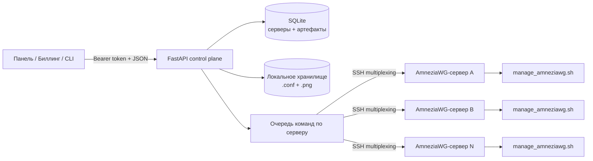

<div align="center">


# AmneziaWG API

**Компактный control plane для управления клиентами AmneziaWG на удалённых серверах.**

Превращает SSH-операции в понятный HTTP API: регистрирует серверы, создаёт пиры,
управляет сроками действия и выдаёт готовые конфиги вместе с QR-кодами.

[](https://www.python.org/)
[](https://fastapi.tiangolo.com/)
[](https://www.docker.com/)
[](https://www.sqlite.org/)
[](#как-это-работает)

[English](README.md) · [Русский](README.ru.md) · [Быстрый старт](#быстрый-старт) · [API](#справочник-api) · [Безопасность](#безопасность)

</div>

> [!IMPORTANT]
> Проект управляет уже установленными серверами AmneziaWG. Самостоятельно
> устанавливать AmneziaWG на удалённые машины он не умеет.

## Зачем Нужен Проект

Обычно AmneziaWG администрируется shell-скриптами непосредственно на VPN-сервере.
Для одного узла этого достаточно, но автоматическая выдача доступов из панели,
биллинга или другого сервиса быстро становится неудобной.

AmneziaWG API добавляет небольшой слой оркестрации:

| Возможность | Что она даёт |
|---|---|
| Реестр серверов | Хранение параметров нескольких VPN-узлов в SQLite |
| Жизненный цикл клиентов | Создание, просмотр, продление и удаление клиентов |
| Сроки подписки | Понятные даты окончания в формате `ДД.ММ.ГГГГ` |
| Выдача конфигов | Загрузка `.conf` и QR-кодов PNG через API |
| Очередь на сервер | Защита от одновременных управляющих команд на одном узле |
| Повторное использование SSH | Меньше лишних handshake благодаря multiplexing |
| Контейнерный запуск | Docker Compose с постоянным хранилищем |

## Архитектура



API не реализует VPN-протокол. Он вызывает `manage_amneziawg.sh` по SSH,
нормализует вывод скрипта, хранит метаданные серверов и ссылки на созданные
артефакты, а затем предоставляет весь процесс через FastAPI.

## Быстрый Старт

### Требования

На машине с API:

- Python `3.12+`;
- OpenSSH client;
- доступ по SSH-ключу ко всем управляемым серверам.

На каждом VPN-сервере:

- рабочая установка AmneziaWG;
- Bash `4+`;
- `manage_amneziawg.sh`, по умолчанию
  `/root/awg/manage_amneziawg.sh`;
- установленный `qrencode`, если нужны QR-коды;
- право SSH-пользователя запускать управляющий скрипт через `sudo`.

### 1. Настройка

```bash
git clone <your-repository-url>
cd amneziawg-api
cp .env.example .env
```

Задайте в `.env` сильный токен:

```env
API_HOST=127.0.0.1
API_PORT=8000
API_TOKEN=replace-with-a-long-random-secret
DATABASE_PATH=./data/app.db
STORAGE_DIR=./storage
SSH_MULTIPLEXING_ENABLED=true
SSH_CONTROL_DIR=/tmp/amneziawg-ssh
SSH_CONTROL_PERSIST=10m
SERVER_QUEUE_TIMEOUT=120
```

Например, токен можно сгенерировать так:

```bash
python -c "import secrets; print(secrets.token_urlsafe(48))"
```

### 2. Локальный Запуск

```bash
python -m venv .venv
source .venv/bin/activate
pip install -r requirements.txt
uvicorn app:app --host 127.0.0.1 --port 8000 --reload
```

Проверка:

```bash
set -a
source .env
set +a
curl http://127.0.0.1:8000/ \
  -H "Authorization: Bearer $API_TOKEN"
```

Документация FastAPI:

- Swagger UI: `http://127.0.0.1:8000/docs`
- ReDoc: `http://127.0.0.1:8000/redoc`

### 3. Docker Compose

Текущий Compose рассчитан на reverse proxy во внешней Docker-сети `edge`:

```bash
cp .env.example .env
docker network create edge
docker compose up -d --build
```

Контейнер слушает порт `8228` внутри сети `edge`. В текущей конфигурации порт
специально не публикуется на хост. Подключите reverse proxy к `edge` или добавьте
для прямого доступа:

```yaml
services:
  amneziawg-api:
    ports:
      - "8228:8228"
```

После этого API будет доступен по `http://127.0.0.1:8228`.

> [!NOTE]
> Compose монтирует `${HOME}/.ssh` в контейнер как `/root/.ssh:ro`.
> Значение `identity_file`, переданное в API, должно быть путём внутри
> контейнера, например `/root/.ssh/id_ed25519`.

## Первый Клиент

Один раз задайте адрес и токен:

```bash
export AWG_API_URL="http://127.0.0.1:8000"
export AWG_API_TOKEN="replace-with-your-token"
```

### Добавить Сервер

```bash
curl -X POST "$AWG_API_URL/api/servers" \
  -H "Authorization: Bearer $AWG_API_TOKEN" \
  -H "Content-Type: application/json" \
  -d '{
    "name": "vpn-eu-1",
    "host": "203.0.113.10",
    "user": "root",
    "port": 22,
    "identity_file": "/home/api/.ssh/id_ed25519",
    "manage_script_path": "/root/awg/manage_amneziawg.sh",
    "strict_host_key_checking": "accept-new"
  }'
```

Ответ сразу содержит результат SSH-проверки: `is_reachable`, `status` и
человекочитаемый `status_label`.

### Создать Клиента

```bash
curl -X POST "$AWG_API_URL/api/clients" \
  -H "Authorization: Bearer $AWG_API_TOKEN" \
  -H "Content-Type: application/json" \
  -d '{
    "server_id": 1,
    "client_name": "alice-phone",
    "expires_until": "31.12.2026"
  }'
```

Пример ответа:

```json
{
  "succsess": true,
  "server_id": 1,
  "client_name": "alice-phone",
  "files": {
    "conf_url": "http://127.0.0.1:8000/api/files/7d0f...",
    "png_url": "http://127.0.0.1:8000/api/files/b829..."
  }
}
```

### Скачать Конфиг

Для скачивания нужен тот же bearer-токен:

```bash
curl -L \
  -H "Authorization: Bearer $AWG_API_TOKEN" \
  "http://127.0.0.1:8000/api/files/7d0f..." \
  -o alice-phone.conf
```

## Справочник API

Все прикладные эндпоинты требуют заголовок:

```http
Authorization: Bearer <API_TOKEN>
```

| Метод | Эндпоинт | Назначение |
|---|---|---|
| `GET` | `/` | Авторизованная проверка работы сервиса |
| `POST` | `/api/servers` | Добавить сервер и проверить SSH |
| `GET` | `/api/servers` | Получить серверы с актуальным статусом доступности |
| `POST` | `/api/clients` | Создать клиента и получить ссылки на конфиги |
| `GET` | `/api/clients/{server_id}` | Получить клиентов и доступные артефакты |
| `PATCH` | `/api/clients/subscription` | Продлить срок действия клиента |
| `DELETE` | `/api/clients/{server_id}/{client_name}` | Удалить клиента и локальные файлы |
| `GET` | `/api/files/{artifact_id}` | Скачать сохранённый `.conf` или `.png` |

### Получить Клиентов

```bash
curl "$AWG_API_URL/api/clients/1" \
  -H "Authorization: Bearer $AWG_API_TOKEN"
```

Статус нормализуется в `active`, `recent`, `no_handshake` или `unknown`.
Если артефакты клиента сохранены локально, элемент также содержит ссылки на них.

### Продлить Подписку

Дата указывается в формате `ДД.ММ.ГГГГ` и считается до конца выбранного дня
в локальной временной зоне процесса:

```bash
curl -X PATCH "$AWG_API_URL/api/clients/subscription" \
  -H "Authorization: Bearer $AWG_API_TOKEN" \
  -H "Content-Type: application/json" \
  -d '{
    "server_id": 1,
    "client_name": "alice-phone",
    "prolong_until": "31.12.2027"
  }'
```

Новая дата должна быть в будущем и позже текущего срока действия клиента.

### Удалить Клиента

```bash
curl -X DELETE "$AWG_API_URL/api/clients/1/alice-phone" \
  -H "Authorization: Bearer $AWG_API_TOKEN"
```

Клиент удаляется на VPN-сервере, после чего API очищает его локальные файлы и
записи в базе.

> [!NOTE]
> Поле ответа намеренно называется `succsess`: это сохранено для совместимости
> с текущим контрактом API.

## Конфигурация

| Переменная | По умолчанию | Описание |
|---|---:|---|
| `API_HOST` | `127.0.0.1` | Описывает bind host; передайте его вашему process runner |
| `API_PORT` | `8000` | Описывает порт; передайте его вашему process runner |
| `API_TOKEN` | `change-me` | Общий bearer-токен; обязательно заменить в production |
| `DATABASE_PATH` | `./data/app.db` | Путь к SQLite |
| `STORAGE_DIR` | `./storage` | Каталог для конфигов и QR-кодов |
| `SSH_MULTIPLEXING_ENABLED` | `true` | Повторное использование SSH-соединений |
| `SSH_CONTROL_DIR` | `/tmp/amneziawg-ssh` | Каталог управляющих SSH-сокетов |
| `SSH_CONTROL_PERSIST` | `10m` | Значение OpenSSH `ControlPersist` |
| `SERVER_QUEUE_TIMEOUT` | `120` | Ожидание занятого сервера в секундах |

`API_HOST` и `API_PORT` сейчас являются метаданными настроек: команды запуска
передают host и port в Uvicorn явно.

## Как Это Работает

1. Запись сервера хранит SSH-параметры и путь до удалённого скрипта.
2. Каждая операция получает блокировку, отдельную для ID этого сервера.
3. API запускает экранированную команду через системный клиент `ssh`.
4. При создании клиента конфиг скачивается, а QR PNG генерируется удалённо.
5. Файлы попадают в `STORAGE_DIR`, непрозрачные ID артефактов — в SQLite.
6. Авторизованный эндпоинт отдаёт сохранённые файлы вызывающему сервису.

Блокировки действуют только внутри одного процесса. При нескольких Uvicorn
workers или репликах API для гарантированной сериализации нужна внешняя
распределённая блокировка.

## Структура Проекта

```text
.
├── amnezia_api/
│   ├── api/schemas.py                 # Модели запросов и ответов
│   ├── core/                          # Auth, конфиг, БД, очистка вывода
│   ├── repositories/                  # Работа с SQLite
│   ├── services/                      # SSH, очередь, подписки, артефакты
│   └── main.py                        # Роуты FastAPI и сборка приложения
├── docs/assets/                       # Графика README
├── app.py                             # ASGI entry point
├── manage_amneziawg.sh                # Снимок удалённого управляющего скрипта
├── compose.yaml
├── Dockerfile
└── requirements.txt
```

## Безопасность

Сервис создаёт VPN-учётные данные и запускает привилегированные команды на
удалённых узлах. Относитесь к нему как к административной инфраструктуре.

- Не публикуйте API напрямую в интернет без TLS и сетевых ограничений.
- Замените пример токена и не коммитьте `.env`.
- Используйте отдельный SSH-ключ с корректными правами на файл.
- В production фиксируйте host keys: `accept-new` удобен при первом подключении,
  но управляемый `known_hosts` надёжнее.
- Вместо неограниченного root-доступа лучше использовать отдельного пользователя
  с узким правилом `sudoers` только для управляющего скрипта.
- Защищайте `data/` и `storage/`: там находятся метаданные инфраструктуры и
  клиентские VPN-конфиги.
- Резервируйте SQLite и каталог артефактов вместе.
- При подозрении на утечку ротируйте API-токен и SSH-ключи.

Сейчас используется один общий bearer-токен. Для multi-tenant или публичного
развёртывания нужны scoped credentials, аудит, rate limits и secrets manager.

## Диагностика

| Симптом | Что проверить |
|---|---|
| `401 Invalid token` | Точное значение `Authorization: Bearer ...` и загрузку `.env` |
| Сервер имеет статус `offline` | SSH-ключ, host key, порт, firewall и пользователя |
| `Сервер ... занят` / HTTP `429` | Другой запрос удерживает очередь этого сервера |
| Конфиг не найден | Файлы в `/root/awg` и точное имя клиента |
| Не создаётся QR | Наличие `qrencode` на VPN-сервере |
| Локально работает, в Docker нет | Путь `identity_file` должен существовать в контейнере |
| Compose запущен, но порт недоступен | Добавьте `ports:` или используйте сеть `edge` |
| Дата отклонена | Формат `ДД.ММ.ГГГГ`, дата в будущем и позже текущей |

## Текущие Границы

Проект намеренно остаётся компактным. Логичное развитие: автоматические тесты,
изменение и удаление серверов, структурированный аудит, метрики,
распределённые блокировки, scoped API keys и публикация Docker-образов через CI.

## Благодарности

Встроенный управляющий скрипт указывает upstream
[`bivlked/amneziawg-installer`](https://github.com/bivlked/amneziawg-installer).
AmneziaWG и связанные названия принадлежат их правообладателям; этот репозиторий
является независимой API-интеграцией.

## Лицензия

Сейчас файл лицензии отсутствует. Его стоит добавить до приёма внешних
контрибьюций или распространения изменённых версий.
